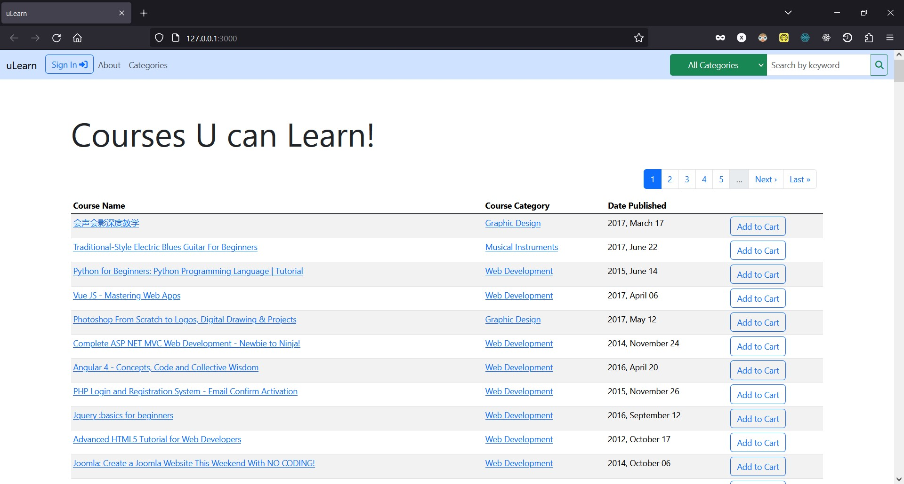

# uLearn

  

## ABOUT this app

  <strong>uLearn</strong> is an app created by team <em>Uncle Sam</em> with Sam Ferrer and Xam Abados. 2021-2023 Business Information Technology students of Red River College Polytechnic for their Full-Stack Web Development class - eCommerce Rails project.
  Sam spearheaded the overall development by doing the backend and major functionalities while Xam
  did the frontend development and styling.

  The application's data source is a Udemy's dataset downloaded from Kaggle. Grouping several fields into their own tables
   making them fit into their application's envisioned functionalities. They deployed this app using Google Cloud which you can visit the link down below.

## VISIT the Deployed Version of this app
* visit https://test-nzsgnmqvfq-uc.a.run.app/
  - Note: as typical college boys, they just availed the free trial of Google Cloud's services, and so they ask the users
 <strong>not to stay too long in the app</strong>, as they only managed to have a <em>limit of 50 hours of usage per month.</em>

## RECREATE this app
* Clone this repository
* Open terminal and run...
  - bundle install
  - rails db:migrate
  - rails db:seed
  - rails s -p <em>[port number]</em>
    - (choose a specific port number, otherwise just run 'rails s')

## SEND us Feedback
* If you have any suggestions or just want to collaborate, please contact us:
  - Sam Ferrer - samferrer145@gmail.com
  - Xam Abados - xavieryabados.09@gmail.com
